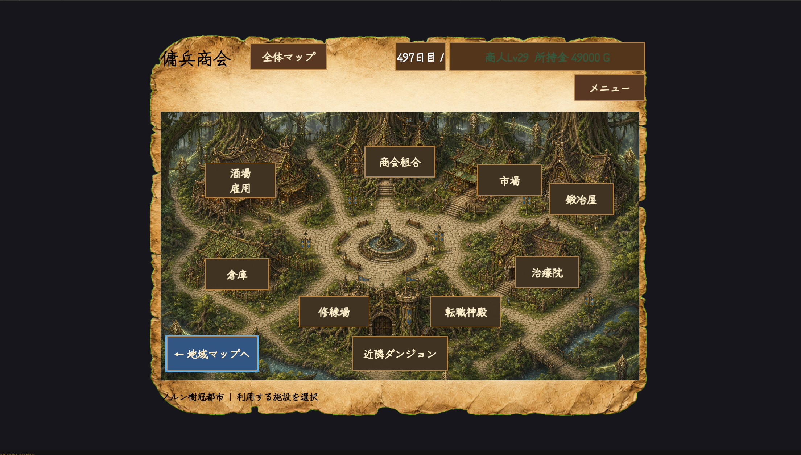
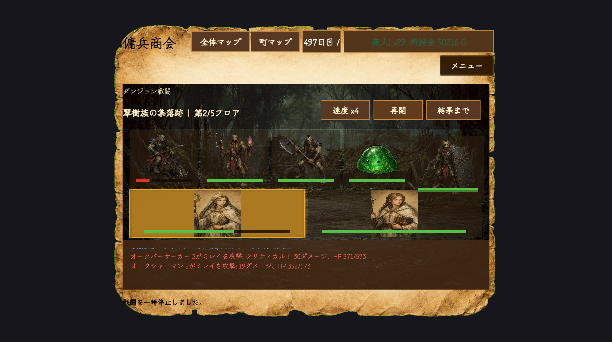
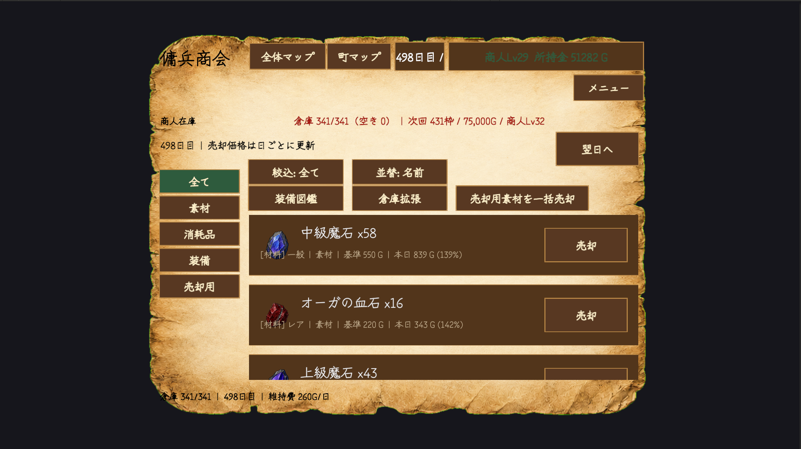

# DungeonMerchant

## 概要

DungeonMerchantは、**商人として傭兵団を運営し、交易・育成・ダンジョン探索によって利益を上げながら、5,000万Gの借金完済を目指す商人経営型ローグライクRPG**です。

プレイヤー自身が戦うのではなく、商人として傭兵を雇用・育成・装備し、経営と探索を繰り返す独自のゲームサイクルを構築しています。

本作品は個人制作で開発しており、システム設計・実装力の向上を目的としたポートフォリオ作品です。

---

# スクリーンショット

<!--
TODO: docs/images/ に実際のスクリーンショットを配置し、下の各行のパスに対応させてください。
撮影のおすすめ画面: 町マップ / 自動戦闘 / 倉庫または鍛冶屋のUI / ダンジョン探索 / 日次リザルト。
Windowsは Win+Shift+S で範囲キャプチャ、Unityのゲームビューを最大化してから撮ると綺麗です。
数秒のGIF(戦闘や町移動)を1枚入れるとさらに伝わります(ScreenToGif等の無料ツール)。
画像を配置したら、この TODO コメントと各行の「(未配置)」注記を削除してください。
-->

| 町マップ | 自動戦闘 |
|---|---|
| <br>（未配置: docs/images/town.png） | <br>（未配置: docs/images/battle.png） |

| 倉庫・経済 | ダンジョン探索 |
|---|---|
| <br>（未配置: docs/images/inventory.png） | <br>（未配置: docs/images/dungeon.png） |

---

# ゲームサイクル

1. 市場で商品・装備を仕入れる
2. 傭兵を雇用する
3. パーティを編成する（最大3人）
4. 装備・治療・転職で育成する
5. ダンジョン・街道へ派遣する
6. 自動戦闘で素材・装備・ゴールドを獲得
7. 戦利品を売却・鍛冶する
8. 借金を返済しながらゲームを進める

---

# 採用ご担当者様へ：10分で見るポイント

初見の方が短時間で主要システムに触れられるよう、プレイルートと確認ポイントをまとめました。

## 5～10分のプレイルート

ゲームは全体マップから始まります。「東方平原地域」→「セイル港湾都市」（初期の町）と選択して町に入ってください。

1. **酒場（雇用）**: 傭兵を1～2人雇用します
2. **編成所**: 雇用した傭兵をパーティに編成します（最大3人）
3. **市場**: 商品・装備を仕入れます（価格は変動します）
4. **近隣ダンジョン**: 初期ダンジョン「はじまりの洞窟」へパーティを派遣し、自動戦闘とフロア進行・撤退判断をご覧ください
5. **鍛冶屋・倉庫**: 戦利品の売却や装備の強化を行います
6. **倉庫の「翌日へ」ボタン**: 日次リザルト画面が表示され、その日の収支を確認できます
7. **地域マップから「リーフ森林都市」へ移動**: 移動中に街道戦闘（3～5連戦の自動戦闘）が発生します

ここまでで、雇用→編成→仕入れ→ダンジョン探索→経済→町間移動という本作の主要サイクルを一通り体験できます。

## コードの見どころ

- **UIの責務分離（Controllerパターン抽出）**: 巨大UIクラスからロジックを段階的に抽出しています。`Assets/Proiject/Scripts/UI/EconomyController.cs` が入口としておすすめです
- **純粋ロジック＋テスト**: `Assets/Proiject/Scripts/Core/WorldMapService.cs` などUnity非依存のロジック層に対し、`Assets/Proiject/Tests/EditMode/` に797件のEditModeテストを整備しています（リファクタリング前後の等価性を810通りの組み合わせで検証するパリティテストを含みます）。PlayModeテスト8件と合わせて計805件が自動実行され、現時点で失敗0件です（[TEST_BASELINE.md](TEST_BASELINE.md)）
- **セーブ・マイグレーション**: 永続IDによる参照解決と、旧形式セーブデータを移行する `SaveDataMigrator` を実装しています
- **AI支援リファクタリングの記録**: `handoff/CLAUDE_WORK_LOG.md` に、AIエージェントと協働した設計判断・リファクタリングの経緯を全て記録しています

### スクリプト解説

全158スクリプトについて、各ファイルの責務を1件ずつ解説した資料です。

| 資料 | 内容 |
|---|---|
| [SCRIPT_REFERENCE_CORE.md](docs/SCRIPT_REFERENCE_CORE.md) | ゲームロジック層 86ファイル（Core / Item / Mercenary / Merchant / Battle / Dungeon ほか） |
| [SCRIPT_REFERENCE_UI.md](docs/SCRIPT_REFERENCE_UI.md) | UI層 72ファイル（composition root / Controller / Presenter / View / 基盤） |
| [CODE_WALKTHROUGH.md](docs/CODE_WALKTHROUGH.md) | 処理の流れで追う解説。起動 → 基本状態 → 傭兵 → 戦闘 → UI の順に、設計判断の理由まで掘り下げる |

## セーブデータの保存先

プレイ内容は以下の場所にJSON形式で保存されます。新規プレイの場合は初回起動時に自動生成されます。

```
%USERPROFILE%\AppData\LocalLow\YugaSen\DungeonMerchant\game-save.json
```

---

# 主な実装システム

## 商人システム

- 商人レベル
- 商人能力（交渉・統率・鑑定・兵站）
- 所持金管理
- 借金返済システム

## 傭兵システム

- ランダム生成
- 固有傭兵
- 契約・更新
- レベル
- 経験値
- 転職
- 職業スキル
- パッシブスキル

## 装備システム

- 武器
- 防具
- 装飾品
- 品質
- ランダム能力値
- セット装備
- 最大+10強化
- 装備図鑑

## バトルシステム

- 最大3人パーティ
- 自動戦闘
- 会心
- 回避
- 状態異常
- ボス
- 幻獣

## ダンジョン

- 3～5連戦
- フロア進行
- ランダムイベント
- 撤退
- 踏破報酬

## 経営システム

- 市場価格変動
- 商品仕入れ
- 売却
- 在庫管理
- 鍛冶

## その他

- JSONセーブ
- ランタイムUI生成
- リザルト画面

---

# 使用技術

|項目|内容|
|---|---|
|ゲームエンジン|Unity 2022.3.62f3|
|言語|C#|
|バージョン管理|Git / GitHub|
|データ管理|ScriptableObject / JSON|
|UI|Unity UI|
|AI活用|ChatGPT（設計相談・実装補助・デバッグ支援・画像生成）/ OpenAI Codex・Claude Code（設計レビュー・リファクタリング・テスト追加の支援）|

## AI活用について

本作はAIエージェントを開発ワークフローに組み込んで制作しています。役割分担は以下の通りで、**設計判断・仕様決定・動作検証・最終的なコードレビューはすべて自分自身で行っています**。

- **ChatGPT**: 設計相談、実装補助、デバッグ支援、マップ・UI背景画像の生成
- **OpenAI Codex / Claude Code**: 全体設計のレビュー、責務分離リファクタリングの段階実行、EditMode・PlayModeテストの追加支援

AIとの作業経緯・設計判断の記録は `handoff/` ディレクトリに全て残しており、各設計判断の理由を説明できます。

## アセットの出所

- **画像**（マップ背景・町マーカー・羊皮紙UI等）: ChatGPT（OpenAI）による画像生成（自作プロンプトによる生成物）
- **フォント**: Zen Kurenaido（SIL Open Font License 1.1、ライセンス文は `Assets/Proiject/Fonts/` に同梱）。その他の日本語フォントは実行環境のOSフォントを実行時に読み込む方式で、再配布は行っていません
- **コード・ゲームデザイン**: 自作（上記AI支援を含む）
- ビルドを配布する際は、リポジトリ直下の `LICENSES.txt` をビルドフォルダに同梱してください

---

# プロジェクト構成

|クラス|役割|
|---|---|
|MerchantData|商人情報管理|
|DebtManager|借金・月次返済|
|MercenaryPartyManager|パーティ編成|
|BattleManager|自動戦闘|
|DungeonRunManager|探索進行|
|MerchantInventory|アイテム管理|
|SaveManager|JSONセーブ|
|DungeonMerchantBootstrap|初期化・不足オブジェクト補完|

---

# 開発で工夫した点

ゲーム全体を役割ごとにクラスへ分割し、システム同士の依存を減らした設計を採用しています。

また、職業・装備・敵・ダンジョンなどはScriptableObjectを活用したデータ駆動設計で実装しており、新しいコンテンツを追加しやすい構成を目指しました。

ゲームループが成立した現在も、UIの責務分割やリファクタリングを進め、保守性・拡張性の向上に取り組んでいます。

---

# 起動方法・動作環境

## Unity Editor で実行する

1. Unity Hub の「Add project from disk」からリポジトリルートを選択する
2. **Unity 2022.3.62f3** でプロジェクトを開く
3. `Assets/Proiject/Scenes/Title.unity` を開く
4. Play ボタンを押し、タイトル画面から「新しく始める」を選択する

Build Settings には `Title.unity` → `SampleScene.unity` の順でシーンが登録されています。

## 動作環境

|項目|内容|
|---|---|
|Unity Editor|2022.3.62f3|
|対象プラットフォーム|Windows (StandaloneWindows64)|
|操作デバイス|マウス|
|セーブ先|`%USERPROFILE%\AppData\LocalLow\YugaSen\DungeonMerchant\game-save.json`|
|セーブ形式|JSON|

---

# テスト状況

2026-08-04 時点の自動テスト実行結果です。Unity バッチモードで実行しています。

|プラットフォーム|総数|成功|失敗|スキップ|
|---|---:|---:|---:|---:|
|EditMode|797|795|0|2|
|PlayMode|8|8|0|0|
|**合計**|**805**|**803**|**0**|**2**|

スキップされた2件は `Explicit` 属性を付与した手動実行専用のアセット検証テストであり、不具合ではありません。詳細な内訳・分類・再実行手順は [TEST_BASELINE.md](TEST_BASELINE.md) に記録しています。

---

# 既知の問題

|内容|影響|状態|
|---|---|---|
|`EnemyDataSO` 53件で `persistentId` が未設定|実行時はアセット名へフォールバックするため現在の動作に影響なし。実効IDの重複もない。将来アセット名を変更した場合に参照復元が壊れる可能性がある|既知。ID付与が完了するまで対象アセット名を変更しない運用で回避|
|`BalanceExpansionDefinitionTests` の2件が自動実行から除外|Editorツールによるアセット生成が前提のため `Explicit` 指定。バッチ実行では検証されない|仕様。Test Runner から手動実行で確認可能|
|倉庫容量判定 `ProgressionManager.CanStore()` が依存 null 時に `true` を返す（fail-open）|参照解決に失敗した構成で容量制限が無効化されうる|課題として特定済み（`ProgressionManager.cs:99-104`）。改善計画に記載|

UI層の責務集中は段階的リファクタリングで**解消済み**です。`SimpleMercenaryHireUI` は **19本・8,627行から5本・2,991行（65%減）**まで縮小し、**19のView/Presenterクラス**を抽出しました。抽出クラスは元クラスへの参照・`FindObjectOfType` を持たず、依存はコンストラクタ注入のみです。主要Presenterのコンストラクタも責務別の依存束へ再編し、最大53引数から**3〜5引数**に整理しています（詳細は [handoff/UI_REFACTOR_HANDOFF.md](handoff/UI_REFACTOR_HANDOFF.md)）。セーブ書き込みも一時ファイル経由の原子的置換（`.tmp`→`File.Replace`、既存は `.bak` 退避）へ改善済みです。

なお、ドロップ装備と装備特殊能力については、セーブデータ整合性の監査を実施済みです。`ItemDataSO` 217件すべてに `persistentId` が設定され重複がないこと、特殊能力がマスタ側（`ItemDataSO.equipmentEffects`）に保持されるため個体データの保存形式変更を伴わないこと、`GameSaveData.CurrentVersion = 37` と `SaveDataMigrator` の整合が取れていることを確認しており、**セーブ・再起動・ロードによる装備や特殊能力の消失リスクはありません**。

---

# 今後の予定

機能拡張を重ねた結果、一部のクラスに責務が集中しています。これらを場当たり的に書き換えるのではなく、静的解析と実コードの根拠に基づいて課題を洗い出し、優先度と工数を評価したうえで、既存の自動テストで挙動を維持しながら段階的に改善する計画を策定しました。

完了済み:

- ~~`SimpleMercenaryHireUI` の Presenter/View 分割~~ → **完了**（19本8,627行 → 5本2,991行、19クラス抽出）
- ~~セーブの原子的書き込み~~ → **完了**（`.tmp`→`File.Replace`、`.bak` 退避）
- `FindObjectOfType` の削減 → **一部完了**（134→101箇所。保存経路の全走査を除去し、`??` によるfake-null素通りを全廃）

残る着手順（費用対効果で優先度付け）:

1. 倉庫容量判定の fail-open 修正（依存欠落時に容量制限が無効化される箇所）
2. Bootstrap の初期化順・イベント購読タイミングの固定
3. `FindObjectOfType` の Composition Root への完全集約（残101箇所）
4. Domain アセンブリの拡大（現在は最小実証の2ファイルのみ）

その他の予定:

- ゲームバランス調整
- 新地域・新ダンジョン追加
- 新職業・新装備追加
- 演出・エフェクト強化

改善案の詳細（対象ファイル・行番号・問題点・改善方針・工数見積り）は [IMPROVEMENT_PROPOSALS.md](IMPROVEMENT_PROPOSALS.md) に記載しています。

プロトタイプとして完成した現在のシステムをさらにブラッシュアップし、完成度の高い作品へ発展させることを目標としています。

---

# 関連ドキュメント

|ドキュメント|内容|
|---|---|
|[TEST_BASELINE.md](TEST_BASELINE.md)|自動テストの実行結果、スキップ理由の分類、セーブデータ整合性の監査記録、再実行手順|
|[MANUAL_TEST_CHECKLIST.md](MANUAL_TEST_CHECKLIST.md)|提出前の手動動作確認チェックリスト（セーブ復元、主要ゲームサイクル、Console確認）|
|[IMPROVEMENT_PROPOSALS.md](IMPROVEMENT_PROPOSALS.md)|コードベース精査に基づく改善案と、優先度・工数を評価した着手計画|
|[handoff/CLAUDE_WORK_LOG.md](handoff/CLAUDE_WORK_LOG.md)|AIエージェントと協働した設計判断・リファクタリングの経緯|
|[LICENSES.txt](LICENSES.txt)|使用素材のライセンス（ビルド配布時に同梱してください）|

---

# 開発者

個人制作

ゲームプログラマーを目指してUnity・C#によるゲーム開発を行っています。
システム設計・データ設計・保守性を意識した開発を心掛けています。
